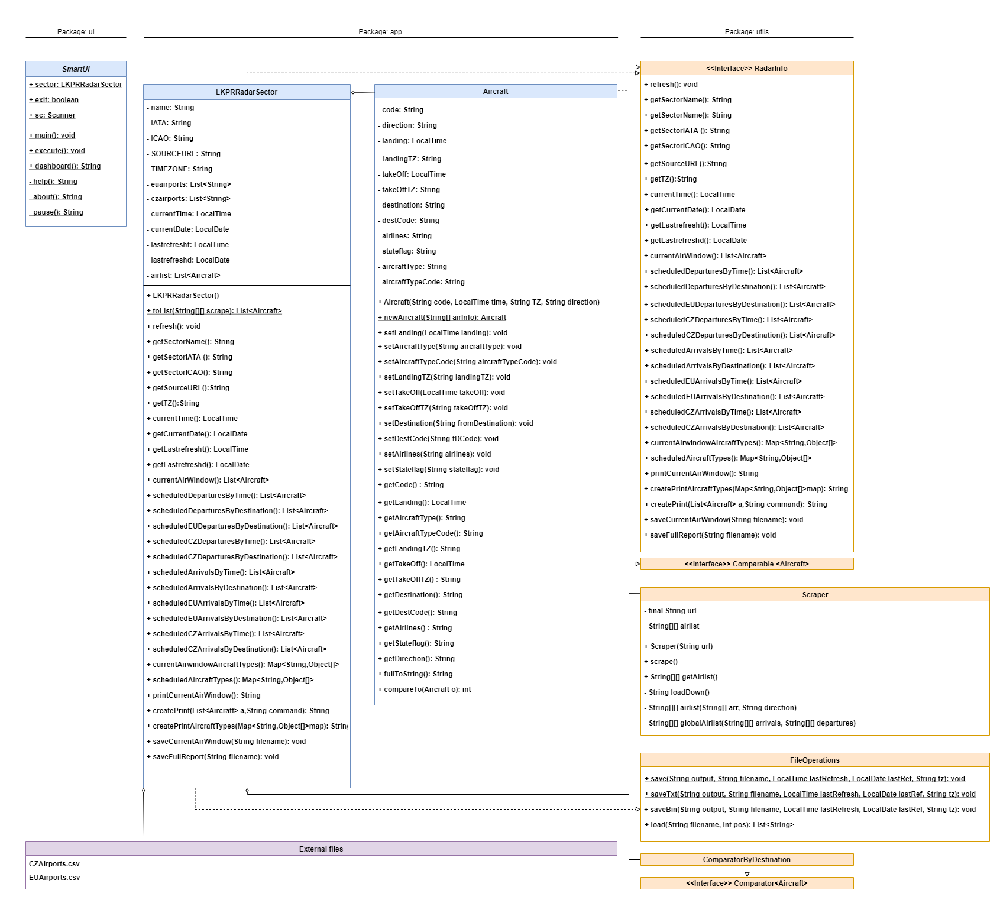

# 2021ALG2Semestral_liskova_AirRadar
2021 ALG2 LS Semestral project

### Zadání
Zapište program poskytující informace o vzdušném prostoru nad letištěm Václava Havla v Praze.\
Pro letiště je veden seznam obsahující letadla plánovaných příletů a odletů, který program umožňuje manuálně aktualizovat. Aktuální informace o odletech a příletech program získává z webu typu skyscanner, případně stránek letiště. Pro každé letadlo je veden kód letu, směr (odlet/přílet), čas příletu, čas odletu, destinace, kód letiště v destinaci, poskytovatel (aerolinky), typ letadla a kód příslušného typu stroje.
V základním výstupu poskytuje program seznam letadel nacházejících se ve vzdušném prostoru nad letištěm, včetně všech dostupných informací.
Program umožňuje získání přehledu plánovaných příletů a odletů, jejich řazení dle času a abecedně dle destinace a filtrování vnitroevropských a vnitrostátních příletů a odletů.
Program dále nabízí výpis typů letadel plánovaných příletů a odletů a jejich počty. Veškeré výpisy je umožněno uložit do textového nebo binárního souboru.\
Pro komunikaci s uživatelem použijte rozhraní příkazové řádky s využitím menu.

### Návrh řešení
#### Funkční specifikace

1. Poskytnutí informací o sledovaném sektoru  
__1.1 **Aktualizace leteckého listu**  
__1.2 **Výpis informací na obrazovku**   
____1.2.1 **Výpis nástěnky** - přehled letadel a jejich typů aktuálně se nacházejících nad letištěm v Praze, aktuální informace o letišti   
____1.2.2 **Výpis plánovaných příletů**  
______1.2.2.1 Výpis plánovaných příletů řazený dle času příletu  
______1.2.2.2 Výpis plánovaných příletů řazený abecedně dle původní destinace  
______1.2.2.3 Výpis plánovaných vnitroevropských příletů řazený dle času příletu  
______1.2.2.4 Výpis plánovaných vnitroevropských příletů řazený abecedně dle původní destinace  
______1.2.2.5 Výpis plánovaných vnitrostátních příletů řazený dle času příletu    
______1.2.2.6 Výpis plánovaných vnitrostátních příletů řazený abecedně dle původní destinace    
____1.2.3 **Výpis plánovaných odletů**  
______1.2.3.1 Výpis plánovaných odletů řazený dle času příletu  
______1.2.3.2 Výpis plánovaných podletů řazený abecedně dle cílové destinace  
______1.2.3.3 Výpis plánovaných vnitroevropských odletů řazený dle času příletu  
______1.2.3.4 Výpis plánovaných vnitroevropských odletů řazený abecedně dle cílové destinace    
______1.2.3.5 Výpis plánovaných vnitrostátních odletů řazený dle času příletu    
______1.2.3.6 Výpis plánovaných vnitrostátních odletů řazený abecedně dle cílové destinace    
____1.2.4 **Výpis typů letadel** plánovaných spojů a jejich počtu  
____1.2.5 **Výpis nápovědy k programu**  
2. **Uložení informací do souboru**  
__2.1 **Uložení do binárního souboru**   
____2.1.1 Uložení výpisu nástěnky  
____2.1.2 Uložení kompletního výpisu všech dostupných informací  
____2.1.3 Uložení nápovědy  
____2.1.4 Uložení plánovaných příletů    
______2.1.4.1 Uložení plánovaných příletů řazených dle času příletu  
______2.1.4.2 Uložení plánovaných příletů řazených abecedně dle původní destinace  
______2.1.4.3 Uložení plánovaných vnitroevropských příletů řazených dle času příletu  
______2.1.4.4 Uložení plánovaných vnitroevropských příletů řazených abecedně dle původní destinace  
______2.1.4.5 Uložení plánovaných vnitrostátních příletů řazených dle času příletu    
______2.1.4.6 Uložení plánovaných vnitrostátních příletů řazených abecedně dle původní destinace    
__2.2 **Uložení do textového souboru**  
____2.2.1 Uložení výpisu nástěnky    
____2.2.2 Uložení kompletního výpisu všech dostupných informací  
____2.2.3 Uložení nápovědy  
____2.2.4 Uložení plánovaných příletů    
______2.2.4.1 Uložení plánovaných příletů řazených dle času příletu  
______2.2.4.2 Uložení plánovaných příletů řazených abecedně dle původní destinace  
______2.2.4.3 Uložení plánovaných vnitroevropských příletů řazených dle času příletu  
______2.2.4.4 Uložení plánovaných vnitroevropských příletů řazených abecedně dle původní destinace  
______2.2.4.5 Uložení plánovaných vnitrostátních příletů řazených dle času příletu    
______2.2.4.6 Uložení plánovaných vnitrostátních příletů řazených abecedně dle původní destinace
       
    
#### Struktura vstupních a výstupních souborů
Program získává aktuální informace z webu ve formě html souboru. Parsing je  nastaven pro konkrétní stránku https://flightaware.com/live/airport/LKPR.
Pevné zdrojové soubory obsahující IATA kódy letišť jsou ve formátu .csv.

Výstupními soubory jsou textové .txt nebo binární .bin soubory. Všechny výstupní soubory obsahují hlavičku s časem poslední aktualizace dat, příslušným časovým pásmem a datem.  
V textových souborech je hlavička na prvním řádku, dále následuje uživatelem zvolený výpis.  
Binární soubory jsou ve formátu: (long - čas poslední aktualizace v sekundách od počátku dne), (UTF - časové pásmo), (UTF - datum poslední aktualizace), (UTF - požadovaný výpis).  
                            

#### Objektový návrh - diagram

[Diagram link](https://drive.google.com/file/d/1GoTmgKgn3MQHBkh5TMceui2VmUbsW5D3/view?usp=sharing)
  
### Testování
### Popis fungování externí knihovny - Jsoup
Jako externí knihovna byla zvolena knihovna Jsoup Java real-world HTML Parser pro zpracování HTML souborů.\
Program využívá příkaz Jsoup.connect() knihovny pro získání HTML souboru s aktuálními daty ze zadané webové adresy.\
    
    Document doc = Jsoup.connect("link").get();
    String loadString = doc.toString();
     

